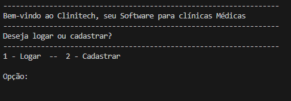

# ProjetoConsultorio

## Descrição

Este é um projeto de um consultório médico chamado Clinitech com a finalidade de criar um ambiente que permita ao usuário agilidade e facilitar o trabalho para gerenciamento de consultas, clientes e funcionários, permitindo armazenar e acessar as informações quando necessário.

## Funcionalidades

- Logar
- cadastrar

- Cadastrar Cliente
- Buscar Cliente
- Modificar Cliente
- Deletar Cliente

- Cadastrar Consulta
- Buscar Consulta
- Modificar Consulta
- Deletar COnsulta

- Cadastrar Médico
- Buscar Médico
- Modificar Médico
- Deletar Médico

- Cadastrar Atendente
- Buscar Atendente
- Modificar Atendente
- Deletar Atendente

- Mostrar todos os Atendentes
- Mostrar todos os Médicos
- Mostrar todos os Clientes
- Mostrar todas as Consultas
- Valor total das consultas agendadas do sistema
- Sair

## Como Usar

- git clone https://github.com/MiVinicius/ProjetoConsultorio.git

- cd ProjetoConsultorio

- python -m venv venv

- python main.py

- (se eu não estiver errado sobre isso)

- Login = admin
- senha = admin
- tipo = 0

